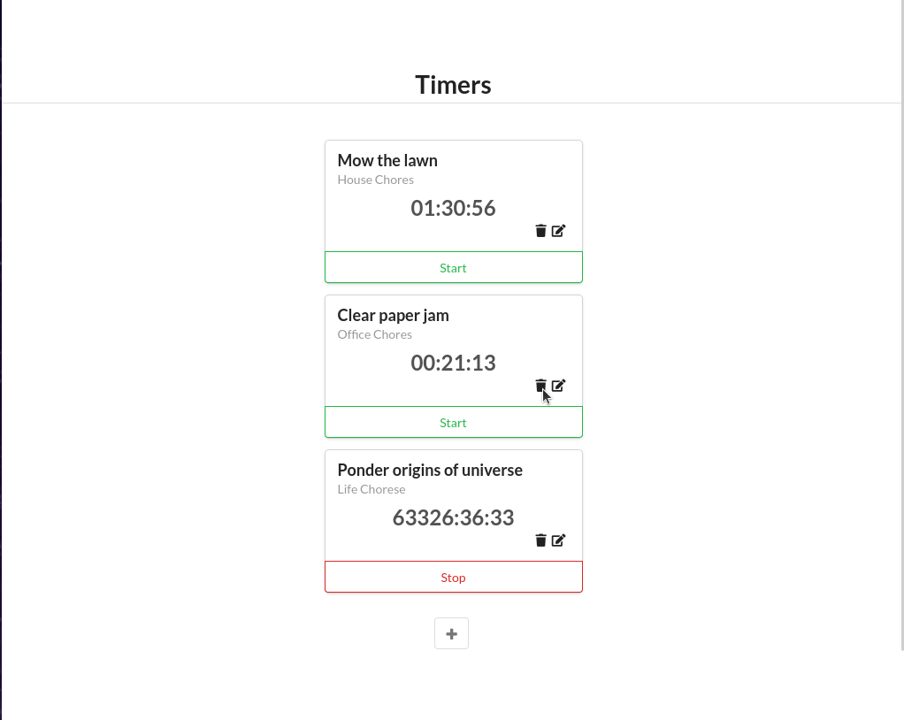

# Fullstack React

## Voting App
ReactJS Application which allows for voting of products similarly to ProductHunt.

## Time Tracking App
ReactJS Application for creating, updating, and deleting timers with a small Node server. Timers can be stop, started, edited and deleted.

## Forms App
A simple React application demonstrating the use of form and input elements within React. This example starts off with a simple demonstration of buttons and onClick to using input and select elements with Redux and creating components for form validation.

