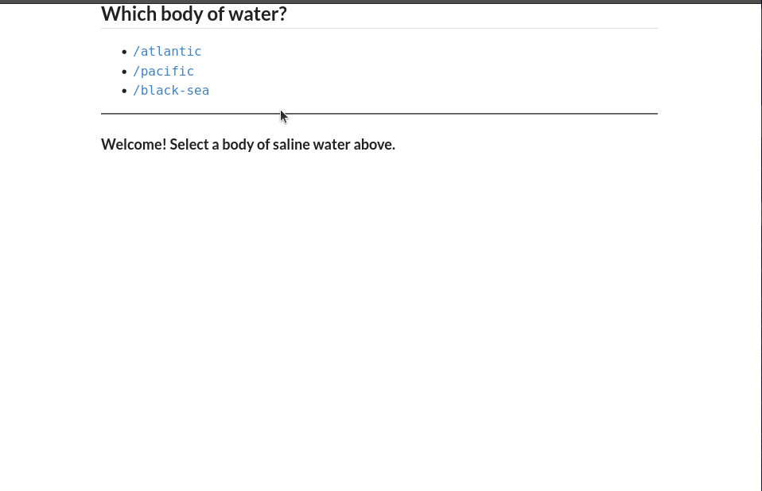

# Fullstack React

## Voting App
ReactJS Application which allows for voting of products similarly to ProductHunt.

## Time Tracking App
ReactJS Application for creating, updating, and deleting timers with a small Node server. Timers can be stop, started, edited and deleted.

## Forms App
A simple React application demonstrating the use of form and input elements within React. This example starts off with a simple demonstration of buttons and onClick to using input and select elements with Redux and creating components for form validation.

## React Basics Testing
A simple React appplication with a list of text elements which are added from an input field and button. This small application was build to apply simple unit tests with behavior driven testing. Unit tests were created with Jest and Enzyme testing frameworks.

## Routing - Basic
In this example we explore creating a simple routing component and then mirgrating those components to React Routes. This small example display three links. Two of the links display some information while the third link displays a count down timer and navigates the user back to the root page.

## Chat App
This small chat application uses ReactJS and Redux to maintain application state. Within this example there are two chat converstations with two seperate list of messages. Redux handles the application state and the React components recieve the application state changes as props. This allows the React Components to focus on rendering HTML and minimal component state.

