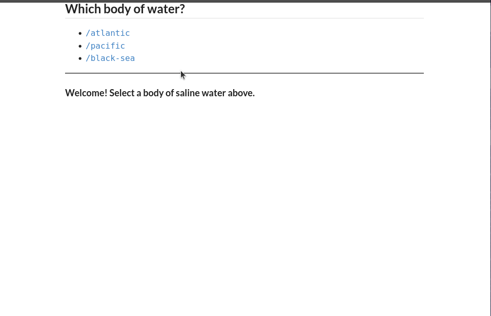

# Routing - Basic
In this example we explore creating a simple routing component and then mirgrating those components to React Routes. This small example display three links. Two of the links display some information while the third link displays a count down timer and navigates the user back to the root page.

## Demonstration Gif

