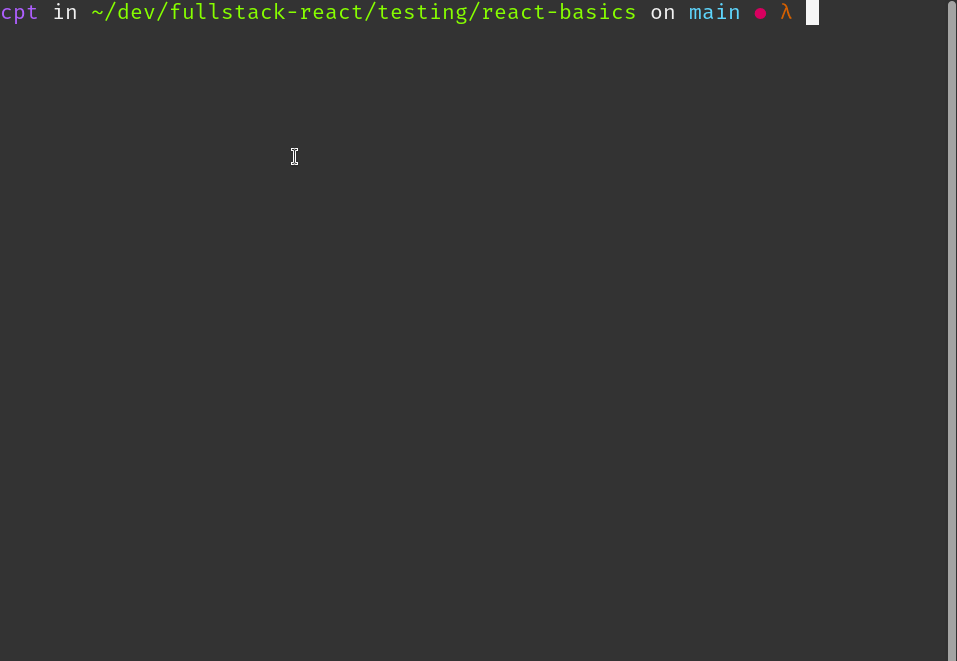

# React Basics
This simple application has a list of text elements which are added by an input field and a button. The goal of this project was to create unit tests with behavior driven testing.

Example Gif:

Tests Gif:

