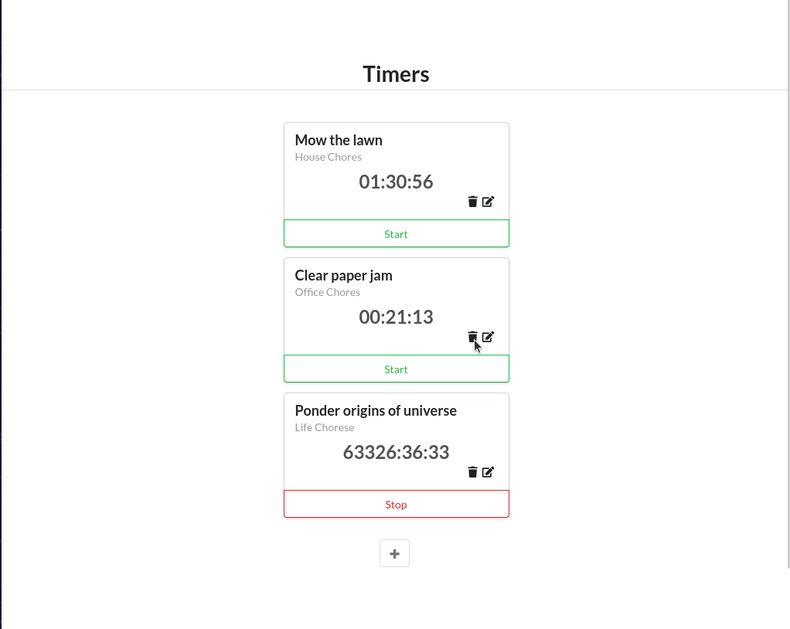

# Time Tracking App
ReactJS Application for creating, updating, and deleting timers with a small Node server. Timers can be stop, started, edited and deleted.

This is a small ReactJS application which demonstrates the following:
- Components
- State & Props
- User Input
- Server Communication

## Demonsraton GIF


## Setup and Execution

1. Run `npm install` to install dependencies.

```shell
npm install
```

2. Start `live-server` to run the application.

```shell
npm run start
```

3. View application in browser at `localhost:3000`.

