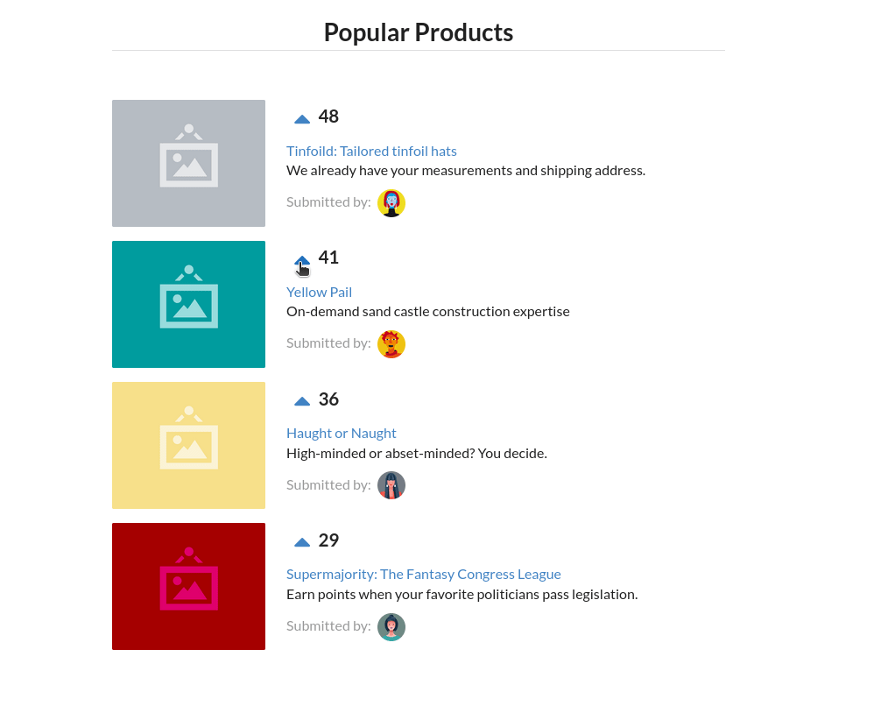

# Voting App
This applicaiton is a voting appplication which works similar to ProductHunt. It's a small ReactJS application which demonstrates:
- ReactJS Components
- Rendering JSX
- Oneway data flow
- Immutability and State
- ReactJS lifecycles

## Demonstration GIF


## Setup and Execution

1. Run `npm install` to install dependencies.

```shell
npm install
```

2. Start `live-server` to run the application.

```shell
npm run start
```

3. View application in browser at `localhost:3000`.
